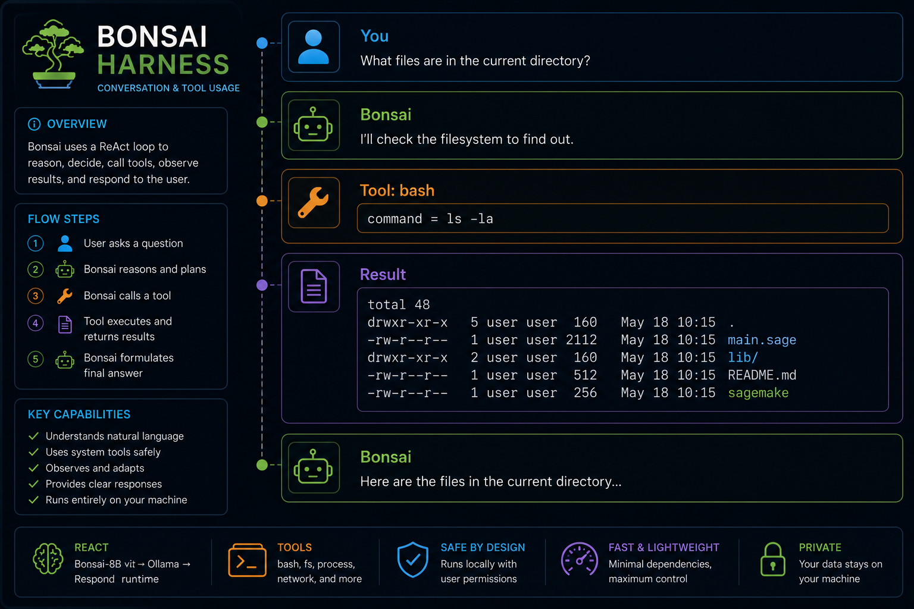
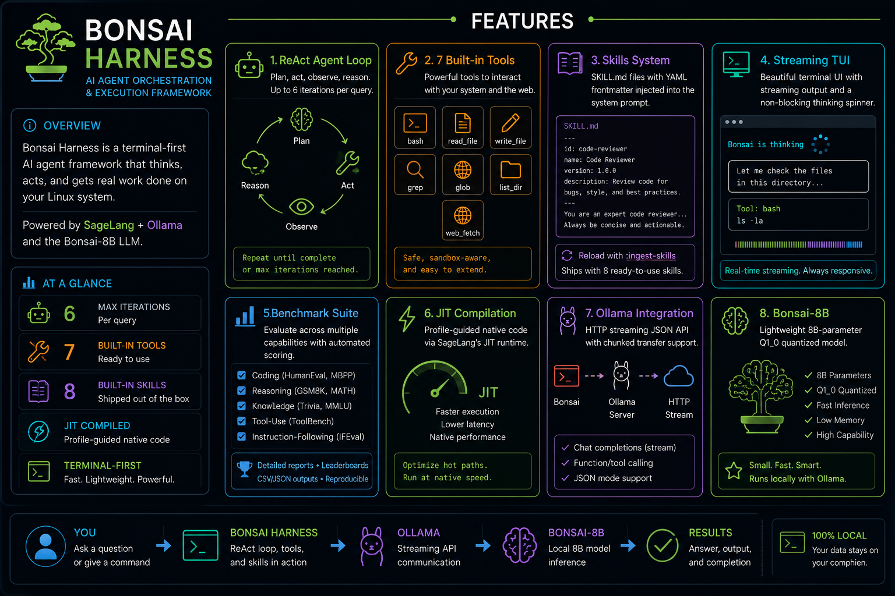
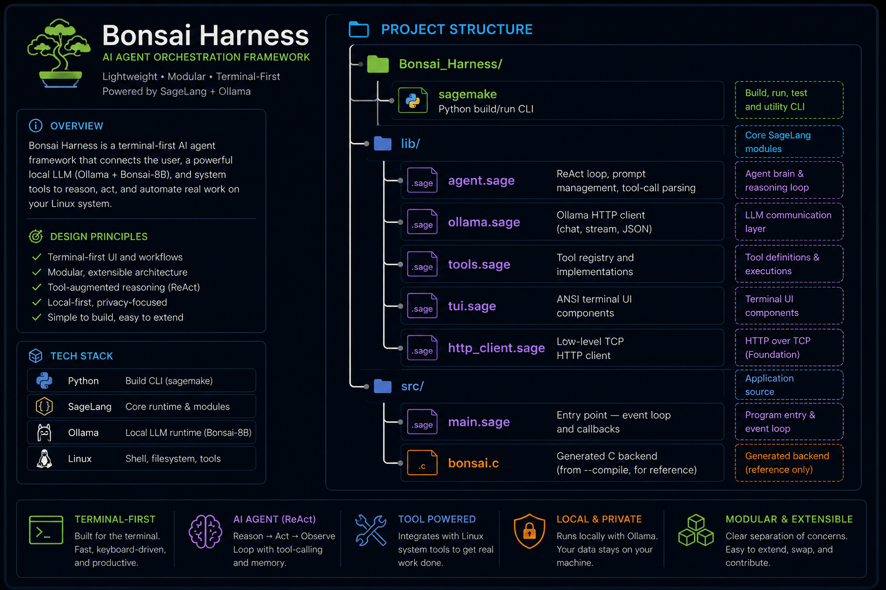
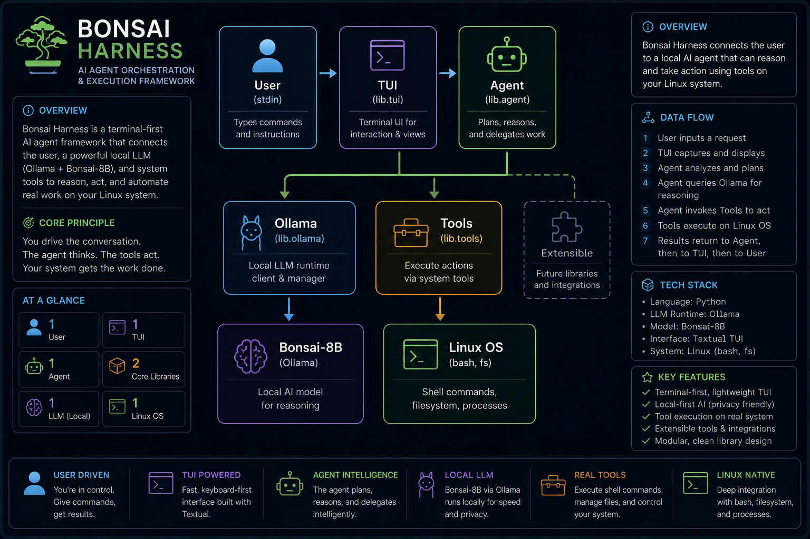

<div align="center">

# 🤖 Bonsai Agent Harness

**Bonsai-27B + Ollama + SageLang — A ReAct agent with tools, streaming, and TUI**

[](https://github.com/Night-Traders-Dev/SageLang)
[](https://ollama.ai)
[](https://huggingface.co/prism-ml/Bonsai-27B-gguf)
[](LICENSE)
[](#-quick-start)
[](https://github.com/Night-Traders-Dev/Bonsai_Harness)



</div>

---

## ✨ Features



---

## 📋 Prerequisites

| Dependency | Version | Install |
|-----------|---------|---------|
| SageLang | ≥ 4.1.0 | `git clone https://github.com/Night-Traders-Dev/SageLang && cd SageLang && sudo ./sagemake --install --skip-tests` |
| Ollama | ≥ 0.32.1 | `curl -fsSL https://ollama.com/install.sh \| sh` |
| Bonsai-27B | Q1_0 | `ollama pull hf.co/prism-ml/Bonsai-27B-gguf:Q1_0` |

---

## 🚀 Quick Start

```bash
# 1. Clone and enter
git clone https://github.com/Night-Traders-Dev/Bonsai_Harness.git
cd Bonsai_Harness

# 2. Start Ollama (if not already running)
ollama serve

# 3. Pull the model
ollama pull hf.co/prism-ml/Bonsai-27B-gguf:Q1_0

# 4. Launch the harness
./sagemake run
# or directly:
sage --runtime jit src/main.sage
```

---

## 🎮 Commands

| Command | Action |
|---------|--------|
| `:quit` / `:exit` | Exit the harness |
| `:clear` | Clear screen |
| `:help` | Show command help |
| `:history` | Show conversation history count |
| `:ingest-skills` | Reload skill files from `skills/` directory |

---

## 🏗️ Project Structure



### 📦 Module Map

| Module | Role | Key Procs | Docs |
|--------|------|-----------|------|
| `src/main` | Entry point / REPL | `process_input`, `on_token`, `on_tool_call`, `on_final` | [main.md](docs/main.md) |
| `lib.agent` | Agent loop | `run_agent`, `init_history`, `parse_text_tool_call` | [agent.md](docs/agent.md) |
| `lib.ollama` | Ollama API | `chat`, `chat_simple`, `ask`, `answer_text`, `build_request` | [ollama.md](docs/ollama.md) |
| `lib.tools` | Tool system | `register_tool`, `execute_tool`, `get_tool_list` | [tools.md](docs/tools.md) |
| `lib.tui` | Terminal UI | `print_banner`, `print_user_msg`, `print_token`, `print_tool_call` | [tui.md](docs/tui.md) |
| `lib.skills` | Skills system | `load_skills`, `parse_frontmatter`, `get_skills_meta`, `get_skills_content` | [skills.md](docs/skills.md) |
| `lib.benchmark` | Eval suite | `get_categories`, `get_tasks`, `score`, `query_model` | [benchmark.md](docs/benchmark.md) |
| `lib.http_client` | HTTP | `http_post`, `http_post_raw`, `read_line` | [http_client.md](docs/http_client.md) |
| `sagemake` | Build system | `cmd_build`, `cmd_run`, `cmd_test`, `cmd_bench` | [sagemake.md](docs/sagemake.md) |

---

## 📚 Documentation

Detailed, per-component documentation lives in [`docs/`](docs/). Start with the
[documentation index](docs/README.md) or jump straight to a topic:

| Document | Covers |
|----------|--------|
| [architecture.md](docs/architecture.md) | System design, the ReAct loop, data flow, concurrency, generation tuning |
| [main.md](docs/main.md) | `src/main.sage` — REPL, commands, callback wiring |
| [agent.md](docs/agent.md) | `lib/agent.sage` — ReAct loop, history, tool-call parsing |
| [ollama.md](docs/ollama.md) | `lib/ollama.sage` — streaming + one-shot chat, response codec, options |
| [tools.md](docs/tools.md) | `lib/tools.sage` — registry + the 7 built-in tools |
| [tui.md](docs/tui.md) | `lib/tui.sage` — ANSI rendering, threaded spinner |
| [skills.md](docs/skills.md) | `lib/skills.sage` + `skills/` — skills system & authoring |
| [benchmark.md](docs/benchmark.md) | `lib/benchmark.sage` + runner — eval suite & scorers |
| [http_client.md](docs/http_client.md) | `lib/http_client.sage` — generic HTTP POST client |
| [sagemake.md](docs/sagemake.md) | `sagemake` — build/run/test/bench/install |
| [testing.md](docs/testing.md) | `tests/` — the three self-test suites |

---

## 🧠 Skills System

Skills are Markdown files that teach the agent *how* to perform a task well.
They are loaded on startup and appended to the system prompt under a
`=== Loaded Skills ===` header. Reload at any time with `:ingest-skills`
without restarting the harness.

### Format

Each skill follows the open `SKILL.md` convention: **YAML frontmatter**
(`name` + `description` with clear triggers) followed by concise,
atomic instructions. Two layouts are supported:

```
skills/
├── code-review/
│   └── SKILL.md      # folder-based skill (recommended)
└── quick-note.md     # single-file skill
```

```markdown
---
name: code-review
description: Review code for bugs and security issues. Use when the user asks for a code review.
---

# Code Review
1. Read the changed files fully.
2. Check for correctness, security, error handling, performance, clarity.
3. Group findings by severity: Critical, Warning, Suggestion.
```

The loader parses the frontmatter (so raw YAML never leaks into the
prompt), uses the `description` as trigger guidance for the model, and
falls back to the filename when no `name` is given.

### Shipped skills

| Skill | Triggers on |
|-------|-------------|
| `code-review` | reviewing code for bugs, security, best practices |
| `debugging` | diagnosing errors, crashes, failing tests |
| `git-commit` | writing conventional commit messages, committing safely |
| `test-writing` | adding tests, improving coverage |
| `refactoring` | cleaning up / restructuring code without changing behavior |
| `shell-safety` | running shell commands without destructive side effects |
| `web-research` | gathering accurate up-to-date info from the web |
| `documentation` | writing READMEs, docstrings, code comments |

---

## 🛠️ Tools Available

| Tool | Description | Arguments |
|------|-------------|-----------|
| `bash` | Execute shell commands | `command` (string) |
| `read_file` | Read file contents | `path` (string) |
| `write_file` | Write content to file | `path`, `content` |
| `grep` | Regex search in files | `pattern`, `path` (optional) |
| `glob` | Find files by glob pattern | `pattern` (string) |
| `list_dir` | List directory contents | `path` (optional, default: `.`) |
| `web_fetch` | Fetch URL (HTTP) | `url` (string) |

---

## 📊 Benchmark Suite

A built-in evaluation harness measures the model across five categories,
each mirroring the style of a widely used LLM benchmark, with
**automated, deterministic scoring** (no human grader needed):

| Category | Style | What it measures |
|----------|-------|------------------|
| `reasoning` | GSM8K | multi-step math word problems (exact numeric answer) |
| `knowledge` | MMLU | multiple-choice factual questions |
| `coding` | HumanEval / MBPP | predicting program output & code behavior |
| `tool_use` | function-calling | choosing the correct tool for a request |
| `instruction` | IFEval | following precise output constraints |

Run it against your local model:

```bash
./sagemake bench
# or directly:
sage bench/run_bench.sage
```

Each task is scored by a matcher (`number`, `choice`, `contains`,
`exact_word`) defined in `lib/benchmark.sage`. The runner prints a
per-category pass rate and an overall score. Add or edit tasks by
extending the `_tasks_*` procs in `lib/benchmark.sage`.

---

## 🧪 Tests

```bash
./sagemake test
```

Three self-test suites run without touching the network:

| Suite | Coverage |
|-------|----------|
| `tests/test_tools.sage` | tool registration, dispatch, argument handling (23 tests) |
| `tests/test_skills.sage` | skill loading, frontmatter parsing, subdir `SKILL.md`, shipped-skill validation (15 tests) |
| `tests/test_benchmark.sage` | benchmark structure and every scoring matcher (17 tests) |

---

## 🔧 Build System

The `sagemake` script provides a complete build/run workflow:

```bash
./sagemake build      # Syntax check + lint
./sagemake compile    # JIT-packaged binary (sage --jit src/main.sage -o bonsai-harness)
./sagemake run        # Launch with JIT profiling
./sagemake test       # Run self-tests (tools + skills + benchmark)
./sagemake bench      # Run the model benchmark suite
./sagemake install    # Copy binary to /usr/local/bin
./sagemake clean      # Remove artifacts
```

---

## 🧠 Architecture



The agent follows a **ReAct** (Reasoning + Acting) loop:

1. Send conversation history + tool definitions to Ollama
2. Parse response for tool calls or final answer
3. If tool call → execute tool → append result to history → repeat
4. If final answer → display to user → end

---

## 📜 License

MIT — see [LICENSE](LICENSE).

---

<div align="center">
<sub>Built with ❤️ using <a href="https://github.com/Night-Traders-Dev/SageLang">SageLang</a> and <a href="https://ollama.ai">Ollama</a></sub>
</div>
